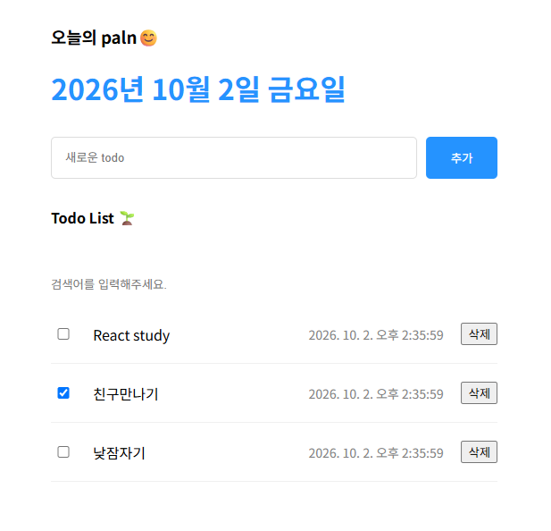

# TODO List

HTML, CSS, JavaScript를 활용하여  
TODO List의 기본적인 CRUD 기능을 구현한 프로젝트입니다.

## 📌 프로젝트 소개

사용자가 할 일을 등록하고, 수정하고, 삭제할 수 있는 TODO List를 구현했습니다.

JavaScript를 이용한 DOM 조작과 이벤트 처리를 중심으로 구현하면서
웹 페이지에서 데이터가 어떻게 추가되고 변경되는지 학습하는 것을 목표로 했습니다.

## 🛠️ 기술 스택

- HTML
- CSS
- JavaScript

## ✨ 주요 기능

- TODO 추가
- TODO 목록 조회
- TODO 수정
- TODO 삭제
- TODO 완료 상태 변경
- 입력값에 따른 목록 변경

## 📚 학습 내용

- JavaScript DOM API를 이용한 HTML 요소 생성 및 수정
- `querySelector`를 이용한 DOM 요소 선택
- `addEventListener`를 이용한 이벤트 처리
- 배열을 이용한 TODO 데이터 관리
- CRUD 기능 구현
- 사용자 입력값 처리
- 동적으로 HTML 요소를 생성하고 화면에 반영하는 방법

## 🔗 링크

- [프로젝트 페이지](https://apiod.github.io/TodoListHtml/index.html)

## 📝 느낀 점

JavaScript를 이용하여 사용자의 입력을 실제 화면에 반영하는 과정을 구현하면서
DOM과 이벤트의 동작 방식을 이해할 수 있었습니다.

특히 데이터를 변경한 뒤 화면을 다시 구성하는 과정을 구현하면서
JavaScript 데이터와 HTML 화면의 관계를 이해하는 데 도움이 되었습니다.
